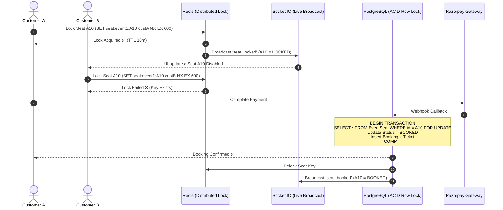

# Eventify SaaS – Master Engineering Blueprint & Architecture Specification

**Project:** Eventify SaaS (Multi-Tenant Event Management & Ticket Booking Platform)  
**Document Status:** Complete Single-Source-of-Truth Architectural Blueprint  
**Primary Audience:** Human Developers & Autonomous AI Agents  
**Git Branch:** `feature/backend`  
**Backend:** Modular Monolith in Node.js / Express.js (`api/`)  
**Frontends:** Marketplace Web, Organizer Dashboard, Admin Dashboard (Built subsequently)

---

## 1. Executive Summary & Vision

Eventify is a multi-tenant Event Management SaaS and high-concurrency Ticket Booking Platform. It powers three core user experiences from a unified backend:

1. **Customer Marketplace (`marketplace-web`):**
   - Browse, search, filter, and discover public events.
   - Interactive seat selection with real-time visual seat locking.
   - Seamless checkout via Razorpay with automated confirmation and digital QR tickets.
   - Self-service booking cancellation and refund status tracking.
2. **Organizer Dashboard (`organizer-dashboard`):**
   - Organization workspace management.
   - Physical venue creation and custom seating layout designer (sections, rows, seats).
   - Event and session scheduling with multi-tier ticket types (`SEATED` vs `NON_SEATED`).
   - Staff invitation, role delegation, and door check-in scanner interface.
   - Real-time event analytics, ticket sales velocity, and revenue reporting.
3. **Super Admin Dashboard (`admin-dashboard`):**
   - Platform-wide governance: Organization onboarding, KYC approvals, suspension, and activation.
   - SaaS subscription tier management (Free, Pro, Enterprise) and usage limit enforcement.
   - Financial audit logs, dispute monitoring, and system telemetry.

---

## 2. AI Agent Operating Rules & Guardrails ("Constitution")

> [!IMPORTANT]
> **Every AI Agent working on this codebase MUST strictly follow these rules without exception:**

1. **Strict Language Rule (JavaScript Only):**
   - The backend uses **JavaScript** (`.js`).
   - **DO NOT** create `.ts` files.
   - **DO NOT** add TypeScript configuration (`tsconfig.json`, `ts-node`, `@types/*`).
   - **DO NOT** attempt to convert the backend to TypeScript without explicit user approval.
2. **Layer Separation & Purity:**
   - **Route:** Endpoint definitions, middleware attachment, and validation binding only. NO business logic.
   - **Validation:** Every incoming request body, query parameter, or route parameter MUST be validated with **Zod** before reaching the controller.
   - **Controller:** Ultra-thin HTTP layer. Extracts validated input, calls the Service, and formats the standard JSON response. Controller MUST NEVER directly access Prisma or write business rules.
   - **Service:** Houses all business rules, calculations, Redis locking, and database queries via Prisma Client.
   - **Shared/Infrastructure:** Houses reusable middleware, custom error classes, response formatters, and utilities. Business logic MUST NOT reside in `shared/`.
3. **Multi-Tenant Isolation:**
   - Eventify is a multi-tenant platform. All organization resources (`venues`, `events`, `sessions`, `staff`, `bookings`) MUST be explicitly scoped by `organization_id`.
   - Never allow Organization A to read, update, or delete Organization B's records.
   - Customers are global platform users who can book events hosted by any organization.
4. **Prisma & Database Safety:**
   - NEVER create database tables manually outside Prisma migrations.
   - NEVER run destructive commands (`prisma migrate reset`, dropping tables, deleting production fields) without explicit user confirmation.
   - Always verify foreign key relationships, indexes, and unique constraints prior to migration creation.
5. **Git Workflow & No Auto-Commits:**
   - AI Agents MUST NOT commit, push, merge, or delete branches automatically unless specifically asked.
   - Work in small, incremental steps: Make code change $\rightarrow$ Review $\rightarrow$ Test server startup & API $\rightarrow$ Check `git diff` $\rightarrow$ Report changes to user.

---

## 3. Technology Stack

| Component | Technology | Purpose |
| :--- | :--- | :--- |
| **Runtime** | Node.js (LTS) | Asynchronous event-driven execution |
| **Language** | JavaScript (`.js`) | Core programming language |
| **Web Framework** | Express.js | High-performance RESTful API routing |
| **Database** | PostgreSQL | Relational integrity, ACID transactions, row-level locking |
| **ORM** | Prisma | Schema modeling, safe migrations, typed database client |
| **Validation** | Zod | Runtime schema validation before controllers |
| **Cache & Locks** | Redis | Temporary seat locking with TTL, caching, rate limiting |
| **Real-Time** | Socket.IO | Live seat map status broadcast (`seat_locked`, `seat_released`) |
| **Async Queue** | RabbitMQ / BullMQ | Background tasks (emails, ticket PDFs, webhooks) |
| **Payments** | Razorpay | Checkout orders, webhook verification, automated refunds |
| **Security** | JWT, bcryptjs, Helmet, CORS | Auth tokens, password hashing, and HTTP protection |

---

## 4. Master Project Directory Blueprint

```text
Eventify/
├── AGENTS.md                         # Authoritative AI Agent behavior guidelines
├── README.md                         # Repository entry point and setup guide
├── docs/                             # Full architectural & product specifications
│   ├── PRD.md                        # Complete Product Requirements Document
│   ├── ProductFoundation.md          # Business model, user personas & features
│   ├── apiDesign.md                  # Comprehensive API endpoint designs
│   ├── apirequestresponsecycle.md    # Request & response payloads with status codes
│   ├── dbDesign.md                   # Initial database conceptual design
│   ├── modifieddbdesign.md           # Production-ready PostgreSQL schema details
│   ├── finalprojectstructure.md      # Full structural breakdown
│   ├── laststepbeforecode.md         # Incremental coding & verification rules
│   ├── laterrequirements.md          # Post-MVP features roadmap
│   ├── projectStructure.md           # Modular Monolith architecture design
│   ├── rolesandpermission.md         # RBAC matrix and access control list
│   ├── systemarchitecture.md         # Distributed architecture & scaling strategy
│   ├── userflow.md                   # End-to-end user journeys
│   └── PROJECT_PLAN.md               # This Master Engineering Blueprint
├── api/                              # Backend Application Root
│   ├── prisma/
│   │   ├── schema.prisma             # PostgreSQL schema definition
│   │   └── migrations/               # Prisma migration history
│   ├── src/
│   │   ├── config/                   # Centralized configuration
│   │   │   ├── env.js                # Environment variable parsing and validation
│   │   │   ├── database.js           # Database connection configuration
│   │   │   ├── redis.js              # Redis client connection setup
│   │   │   ├── razorpay.js           # Razorpay SDK initialization
│   │   │   └── jwt.js                # Token secrets and expiry configuration
│   │   ├── database/
│   │   │   └── prisma.js             # Shared PrismaClient singleton instance
│   │   ├── modules/                  # Business Modules (Isolated Domains)
│   │   │   ├── auth/                 # Customer & Staff login, register, refresh, password reset
│   │   │   ├── users/                # User accounts & customer profile management
│   │   │   ├── organizations/        # Organization tenant workspaces & invitations
│   │   │   ├── venues/               # Venues, sections, and seating layout builder
│   │   │   ├── events/               # Events, sessions, and capacity management
│   │   │   ├── ticket-types/         # Pricing tiers (VIP, Regular, Early Bird)
│   │   │   ├── bookings/             # Booking engine, seat lock coordinator
│   │   │   ├── payments/             # Razorpay order generation & webhook processing
│   │   │   ├── tickets/              # QR code ticket generation & customer passes
│   │   │   ├── checkins/             # Door staff QR verification & attendee check-in
│   │   │   ├── refunds/              # Cancellation policies & Razorpay refund calls
│   │   │   ├── staff/                # Staff event assignments & permissions
│   │   │   ├── reviews/              # Event ratings & customer reviews
│   │   │   ├── notifications/        # In-app notifications & email dispatches
│   │   │   └── subscriptions/        # SaaS subscription plans & limit enforcement
│   │   ├── shared/                   # Cross-Cutting Shared Utilities & Infrastructure
│   │   │   ├── middleware/
│   │   │   │   ├── auth.middleware.js        # Validates JWT & sets req.user
│   │   │   │   ├── tenant.middleware.js      # Scopes request to organization
│   │   │   │   ├── authorize.middleware.js   # RBAC role & permission enforcement
│   │   │   │   ├── validate.middleware.js    # Generic Zod validation runner
│   │   │   │   ├── error.middleware.js       # Centralized global error handler
│   │   │   │   └── notFound.middleware.js    # Standard 404 handler for unknown routes
│   │   │   ├── errors/
│   │   │   │   └── AppError.js               # Standard operational error class
│   │   │   ├── utils/
│   │   │   │   ├── apiResponse.js            # Unified success & error response builder
│   │   │   │   ├── asyncHandler.js           # Wraps async controllers to catch errors
│   │   │   │   ├── pagination.js             # Standardized pagination helper
│   │   │   │   ├── password.js               # bcrypt hash & compare helpers
│   │   │   │   ├── jwt.js                    # JWT sign & verify helpers
│   │   │   │   └── qr.js                     # Secure QR hash & QR data URL generator
│   │   │   └── constants/
│   │   │       ├── roles.js                  # System roles enum
│   │   │       ├── statuses.js               # Event, booking, ticket status enums
│   │   │       └── errorCodes.js             # Application error code constants
│   │   ├── routes/
│   │   │   └── index.js                      # Registers all module routes under /api/v1
│   │   ├── app.js                            # Express app setup, middleware registration
│   │   └── server.js                         # HTTP server boot, port listening, shutdown
│   ├── tests/                                # Automated integration & unit tests
│   ├── .env
│   ├── .env.example
│   └── package.json
├── marketplace-web/                          # Customer Marketplace (Frontend - Phase 2)
├── organizer-dashboard/                      # Organizer SaaS ERP (Frontend - Phase 2)
└── admin-dashboard/                          # Super Admin Platform Dashboard (Frontend - Phase 2)
```

---

## 5. Complete Database Schema & Entity Specification

The database utilizes PostgreSQL with Prisma ORM. Below is the comprehensive entity specification detailing all fields, types, constraints, and relationships:

### 5.1 Identity, Multi-Tenancy & Access Control

#### `User`
- `id`: UUID (PK, default `uuid()`)
- `name`: VARCHAR(100), NOT NULL
- `email`: VARCHAR(255), UNIQUE, NOT NULL
- `password_hash`: VARCHAR(255), NOT NULL
- `phone`: VARCHAR(20), NULL
- `status`: VARCHAR(20), default `ACTIVE` (`ACTIVE`, `INACTIVE`, `SUSPENDED`)
- `created_at`: TIMESTAMP, default `now()`
- `updated_at`: TIMESTAMP, auto-update
- *Relations:* `organization_memberships`, `invitations_created`, `events_created`, `bookings`, `reviews`, `checkins_performed`

#### `Organization`
- `id`: UUID (PK, default `uuid()`)
- `name`: VARCHAR(150), NOT NULL
- `slug`: VARCHAR(150), UNIQUE, NOT NULL
- `status`: VARCHAR(20), default `ACTIVE` (`ACTIVE`, `SUSPENDED`)
- `created_at`: TIMESTAMP, default `now()`
- `updated_at`: TIMESTAMP, auto-update
- *Relations:* `members`, `invitations`, `venues`, `events`, `subscriptions`

#### `OrganizationMember`
- `id`: UUID (PK, default `uuid()`)
- `organization_id`: UUID (FK $\rightarrow$ `Organization.id`, on delete CASCADE)
- `user_id`: UUID (FK $\rightarrow$ `User.id`, on delete CASCADE)
- `role_id`: UUID (FK $\rightarrow$ `Role.id`)
- `status`: VARCHAR(20), default `ACTIVE` (`ACTIVE`, `INACTIVE`)
- `joined_at`: TIMESTAMP, default `now()`
- `created_at`: TIMESTAMP, default `now()`
- `updated_at`: TIMESTAMP, auto-update
- *Constraints:* `UNIQUE(organization_id, user_id)`

#### `Role`
- `id`: UUID (PK, default `uuid()`)
- `organization_id`: UUID, NULL (NULL indicates global system role like `SUPER_ADMIN`; otherwise scoped to specific organization)
- `name`: VARCHAR(100), NOT NULL
- `description`: TEXT, NULL
- `created_at`: TIMESTAMP, default `now()`
- *Relations:* `role_permissions`, `members`

#### `Permission`
- `id`: UUID (PK, default `uuid()`)
- `name`: VARCHAR(100), UNIQUE, NOT NULL (e.g. `events:create`, `tickets:validate`, `finance:read`)
- `description`: TEXT, NULL

#### `RolePermission`
- `role_id`: UUID (FK $\rightarrow$ `Role.id`, on delete CASCADE)
- `permission_id`: UUID (FK $\rightarrow$ `Permission.id`, on delete CASCADE)
- *Constraints:* `PK(role_id, permission_id)`

#### `OrganizationInvitation`
- `id`: UUID (PK, default `uuid()`)
- `organization_id`: UUID (FK $\rightarrow$ `Organization.id`)
- `role_id`: UUID (FK $\rightarrow$ `Role.id`)
- `token`: VARCHAR(255), UNIQUE, NOT NULL
- `expires_at`: TIMESTAMP, NOT NULL
- `max_uses`: INTEGER, NULL (NULL for single use or unlimited)
- `used_count`: INTEGER, default 0
- `status`: VARCHAR(20), default `ACTIVE` (`ACTIVE`, `EXPIRED`, `DISABLED`)
- `created_by`: UUID (FK $\rightarrow$ `User.id`)
- `created_at`: TIMESTAMP, default `now()`

---

### 5.2 Venue & Seating Infrastructure

#### `Venue`
- `id`: UUID (PK, default `uuid()`)
- `organization_id`: UUID (FK $\rightarrow$ `Organization.id`)
- `name`: VARCHAR(150), NOT NULL
- `address`: TEXT, NOT NULL
- `capacity`: INTEGER, NULL
- `status`: VARCHAR(20), default `ACTIVE` (`ACTIVE`, `INACTIVE`)
- `created_at`: TIMESTAMP, default `now()`
- `updated_at`: TIMESTAMP, auto-update
- *Relations:* `seating_layouts`, `event_sessions`

#### `VenueSeatingLayout`
- `id`: UUID (PK, default `uuid()`)
- `venue_id`: UUID (FK $\rightarrow$ `Venue.id`, on delete CASCADE)
- `name`: VARCHAR(150), NOT NULL (e.g. "Standard Theatre Layout", "Concert Stage Layout")
- `description`: TEXT, NULL
- `is_default`: BOOLEAN, default `false`
- `status`: VARCHAR(20), default `ACTIVE` (`ACTIVE`, `INACTIVE`)
- `created_at`: TIMESTAMP, default `now()`
- `updated_at`: TIMESTAMP, auto-update
- *Relations:* `venue_seats`, `event_sessions`

#### `VenueSeat`
- `id`: UUID (PK, default `uuid()`)
- `layout_id`: UUID (FK $\rightarrow$ `VenueSeatingLayout.id`, on delete CASCADE)
- `seat_number`: VARCHAR(20), NOT NULL (e.g. "A1", "102")
- `row_number`: VARCHAR(20), NULL (e.g. "Row A")
- `section`: VARCHAR(100), NULL (e.g. "Balcony", "Front Orchestra")
- `seat_type`: VARCHAR(50), NULL (e.g. "VIP", "Standard", "Accessible")
- `x_position`: DECIMAL(10,2), NOT NULL (Layout coordinate)
- `y_position`: DECIMAL(10,2), NOT NULL (Layout coordinate)
- `status`: VARCHAR(20), default `ACTIVE` (`ACTIVE`, `INACTIVE`)
- `created_at`: TIMESTAMP, default `now()`
- `updated_at`: TIMESTAMP, auto-update
- *Constraints:* `UNIQUE(layout_id, seat_number)`

---

### 5.3 Events, Sessions & Ticket Pricing Tiers

#### `Event`
- `id`: UUID (PK, default `uuid()`)
- `organization_id`: UUID (FK $\rightarrow$ `Organization.id`)
- `title`: VARCHAR(255), NOT NULL
- `slug`: VARCHAR(255), UNIQUE, NOT NULL
- `description`: TEXT, NULL
- `event_type`: VARCHAR(100), NOT NULL (e.g. "Concert", "Conference", "Workshop")
- `status`: VARCHAR(20), default `DRAFT` (`DRAFT`, `PUBLISHED`, `UNPUBLISHED`, `ARCHIVED`)
- `created_by`: UUID (FK $\rightarrow$ `User.id`)
- `created_at`: TIMESTAMP, default `now()`
- `updated_at`: TIMESTAMP, auto-update
- *Relations:* `sessions`, `reviews`, `staff_assignments`

#### `EventSession`
- `id`: UUID (PK, default `uuid()`)
- `event_id`: UUID (FK $\rightarrow$ `Event.id`, on delete CASCADE)
- `venue_id`: UUID (FK $\rightarrow$ `Venue.id`)
- `seating_layout_id`: UUID, NULL (FK $\rightarrow$ `VenueSeatingLayout.id`, required if booking_type is SEATED)
- `booking_type`: VARCHAR(20), NOT NULL (`SEATED`, `NON_SEATED`)
- `start_at`: TIMESTAMP, NOT NULL
- `end_at`: TIMESTAMP, NOT NULL
- `status`: VARCHAR(20), default `SCHEDULED` (`SCHEDULED`, `CANCELLED`, `COMPLETED`)
- `created_at`: TIMESTAMP, default `now()`
- `updated_at`: TIMESTAMP, auto-update
- *Relations:* `ticket_types`, `event_seats`, `bookings`

#### `TicketType`
- `id`: UUID (PK, default `uuid()`)
- `event_session_id`: UUID (FK $\rightarrow$ `EventSession.id`, on delete CASCADE)
- `name`: VARCHAR(100), NOT NULL (e.g. "Early Bird", "VIP Pass", "General Admission")
- `description`: TEXT, NULL
- `price`: DECIMAL(10,2), NOT NULL
- `total_quantity`: INTEGER, NULL (Total capacity for NON_SEATED; NULL or calculated for SEATED)
- `status`: VARCHAR(20), default `ACTIVE` (`ACTIVE`, `INACTIVE`)
- `sale_start_at`: TIMESTAMP, NULL
- `sale_end_at`: TIMESTAMP, NULL
- `created_at`: TIMESTAMP, default `now()`
- `updated_at`: TIMESTAMP, auto-update
- *Relations:* `event_seats`, `booking_items`

#### `EventSeat` (Instantiated Seat for a Session)
- `id`: UUID (PK, default `uuid()`)
- `event_session_id`: UUID (FK $\rightarrow$ `EventSession.id`, on delete CASCADE)
- `venue_seat_id`: UUID (FK $\rightarrow$ `VenueSeat.id`)
- `ticket_type_id`: UUID (FK $\rightarrow$ `TicketType.id`)
- `price`: DECIMAL(10,2), NOT NULL
- `status`: VARCHAR(20), default `AVAILABLE` (`AVAILABLE`, `BLOCKED`, `BOOKED`)
- `created_at`: TIMESTAMP, default `now()`
- `updated_at`: TIMESTAMP, auto-update
- *Constraints:* `UNIQUE(event_session_id, venue_seat_id)`

---

### 5.4 Bookings, Payments, Tickets & Door Check-In

#### `Booking`
- `id`: UUID (PK, default `uuid()`)
- `booking_number`: VARCHAR(50), UNIQUE, NOT NULL
- `user_id`: UUID (FK $\rightarrow$ `User.id`)
- `event_session_id`: UUID (FK $\rightarrow$ `EventSession.id`)
- `total_amount`: DECIMAL(10,2), NOT NULL
- `status`: VARCHAR(20), default `PENDING` (`PENDING`, `CONFIRMED`, `CANCELLED`, `REFUNDED`)
- `payment_status`: VARCHAR(20), default `PENDING` (`PENDING`, `PAID`, `FAILED`, `REFUNDED`)
- `expires_at`: TIMESTAMP, NOT NULL (10-minute temporary checkout window)
- `created_at`: TIMESTAMP, default `now()`
- `updated_at`: TIMESTAMP, auto-update
- *Relations:* `booking_items`, `payment`, `tickets`, `refund`

#### `BookingItem`
- `id`: UUID (PK, default `uuid()`)
- `booking_id`: UUID (FK $\rightarrow$ `Booking.id`, on delete CASCADE)
- `ticket_type_id`: UUID (FK $\rightarrow$ `TicketType.id`)
- `event_seat_id`: UUID, NULL (FK $\rightarrow$ `EventSeat.id`, only for SEATED events)
- `price`: DECIMAL(10,2), NOT NULL
- `quantity`: INTEGER, default 1
- `created_at`: TIMESTAMP, default `now()`
- *Relations:* `tickets`

#### `Payment`
- `id`: UUID (PK, default `uuid()`)
- `booking_id`: UUID, UNIQUE (FK $\rightarrow$ `Booking.id`)
- `razorpay_order_id`: VARCHAR(100), NOT NULL
- `razorpay_payment_id`: VARCHAR(100), NULL
- `razorpay_signature`: VARCHAR(255), NULL
- `amount`: DECIMAL(10,2), NOT NULL
- `currency`: VARCHAR(10), default `INR`
- `status`: VARCHAR(20), default `PENDING` (`PENDING`, `SUCCESS`, `FAILED`, `REFUNDED`)
- `created_at`: TIMESTAMP, default `now()`
- `updated_at`: TIMESTAMP, auto-update

#### `Ticket`
- `id`: UUID (PK, default `uuid()`)
- `booking_id`: UUID (FK $\rightarrow$ `Booking.id`, on delete CASCADE)
- `booking_item_id`: UUID (FK $\rightarrow$ `BookingItem.id`)
- `ticket_number`: VARCHAR(100), UNIQUE, NOT NULL
- `qr_code_hash`: VARCHAR(255), UNIQUE, NOT NULL (Cryptographically signed hash)
- `status`: VARCHAR(20), default `VALID` (`VALID`, `USED`, `CANCELLED`)
- `checked_in_at`: TIMESTAMP, NULL
- `checked_in_by`: UUID, NULL (FK $\rightarrow$ `User.id`)
- `created_at`: TIMESTAMP, default `now()`

#### `Refund`
- `id`: UUID (PK, default `uuid()`)
- `booking_id`: UUID, UNIQUE (FK $\rightarrow$ `Booking.id`)
- `payment_id`: UUID (FK $\rightarrow$ `Payment.id`)
- `razorpay_refund_id`: VARCHAR(100), NULL
- `amount`: DECIMAL(10,2), NOT NULL
- `reason`: TEXT, NULL
- `status`: VARCHAR(20), default `REQUESTED` (`REQUESTED`, `APPROVED`, `REJECTED`, `COMPLETED`)
- `created_at`: TIMESTAMP, default `now()`
- `updated_at`: TIMESTAMP, auto-update

#### `StaffEventAssignment`
- `id`: UUID (PK, default `uuid()`)
- `user_id`: UUID (FK $\rightarrow$ `User.id`)
- `event_id`: UUID (FK $\rightarrow$ `Event.id`)
- `assigned_role`: VARCHAR(50), NOT NULL (e.g. `TICKET_VERIFIER`, `EVENT_COORDINATOR`)
- `created_at`: TIMESTAMP, default `now()`
- *Constraints:* `UNIQUE(user_id, event_id)`

---

## 6. Complete API Catalog & Route Matrix

All API endpoints are versioned under `/api/v1`.

### 6.1 Authentication & Profile (`/api/v1/auth`, `/api/v1/profile`)

| Method | Endpoint | Access | Purpose |
| :--- | :--- | :--- | :--- |
| `POST` | `/auth/customer/register` | Public | Register customer account |
| `POST` | `/auth/staff/register` | Public (Requires Invite Token) | Register organization staff via invitation link |
| `POST` | `/auth/login` | Public | Unified login for all users (returns access + refresh tokens) |
| `POST` | `/auth/refresh` | Authenticated | Obtain new access token using valid refresh token |
| `POST` | `/auth/logout` | Authenticated | Revoke refresh token and clear cookie |
| `GET` | `/auth/me` | Authenticated | Fetch current authenticated user info and permissions |
| `POST` | `/auth/forgot-password` | Public | Send password reset token to email |
| `POST` | `/auth/reset-password` | Public | Reset password using valid reset token |
| `POST` | `/auth/change-password` | Authenticated | Change password while logged in |
| `GET` | `/profile` | Authenticated | Get current user's profile |
| `PATCH` | `/profile` | Authenticated | Update user name, phone, preferences |

### 6.2 Organization Workspaces (`/api/v1/organizations`)

| Method | Endpoint | Access | Purpose |
| :--- | :--- | :--- | :--- |
| `POST` | `/organizations` | Super Admin | Provision new organization workspace |
| `GET` | `/organizations` | Super Admin | List all platform organizations (with pagination & status filter) |
| `GET` | `/organizations/:id` | Super Admin | View specific organization details and metrics |
| `PATCH` | `/organizations/:id/status` | Super Admin | Activate or suspend organization |
| `GET` | `/organizations/me` | Org Admin / Owner | Get current organization details and settings |
| `PATCH` | `/organizations/me` | Org Admin / Owner | Update organization name, contact details, logo |
| `POST` | `/organizations/me/invitations` | Org Admin / Owner | Generate staff invitation token with assigned role |
| `GET` | `/organizations/me/invitations` | Org Admin / Owner | List active and expired invitations |

### 6.3 Venues & Seating Layouts (`/api/v1/venues`)

| Method | Endpoint | Access | Purpose |
| :--- | :--- | :--- | :--- |
| `POST` | `/venues` | Org Admin | Create venue with capacity and address |
| `GET` | `/venues` | Org Staff | List venues belonging to organization |
| `GET` | `/venues/:id` | Org Staff | View specific venue details |
| `PATCH` | `/venues/:id` | Org Admin | Update venue details or address |
| `POST` | `/venues/:id/layouts` | Org Admin | Create seating layout (name, grid config) |
| `GET` | `/venues/:id/layouts` | Org Staff | List seating layouts for venue |
| `POST` | `/venues/:id/layouts/:layoutId/seats` | Org Admin | Batch upsert venue seats with X, Y, section, row |
| `GET` | `/venues/:id/layouts/:layoutId/seats` | Org Staff | Retrieve full seat layout map |

### 6.4 Events & Sessions (`/api/v1/events`)

| Method | Endpoint | Access | Purpose |
| :--- | :--- | :--- | :--- |
| `POST` | `/events` | Org Admin / Event Manager | Create event draft |
| `GET` | `/events` | Org Staff | List organization events (filter by status) |
| `GET` | `/events/:id` | Org Staff | Get event details with sessions |
| `PATCH` | `/events/:id` | Org Admin / Event Manager | Update event title, description, category |
| `PATCH` | `/events/:id/status` | Org Admin | Transition status (`DRAFT` $\rightarrow$ `PUBLISHED` $\rightarrow$ `ARCHIVED`) |
| `POST` | `/events/:id/sessions` | Org Admin / Event Manager | Create session (`SEATED` / `NON_SEATED`, start/end dates) |
| `GET` | `/events/:id/sessions` | Org Staff | List sessions for an event |
| `POST` | `/events/:id/sessions/:sessionId/ticket-types` | Org Admin | Create ticket tier (name, price, capacity) |
| `GET` | `/events/:id/sessions/:sessionId/ticket-types` | Org Staff | List ticket tiers for session |

### 6.5 Public Event Discovery (`/api/v1/public/events`)

| Method | Endpoint | Access | Purpose |
| :--- | :--- | :--- | :--- |
| `GET` | `/public/events` | Public | Search, filter (city, date, price, category), pagination |
| `GET` | `/public/events/:id` | Public | View published event details, venue, organizer |
| `GET` | `/public/events/:id/sessions` | Public | View active sessions for event |
| `GET` | `/public/events/:id/sessions/:sessionId/seats` | Public | Get live seat map with availability status |
| `GET` | `/public/events/:id/sessions/:sessionId/tickets` | Public | Get available ticket tiers & pricing |

### 6.6 Booking & Seat Concurrency (`/api/v1/bookings`)

| Method | Endpoint | Access | Purpose |
| :--- | :--- | :--- | :--- |
| `POST` | `/bookings/lock` | Customer | Temporarily lock selected seats (Redis TTL 10 mins) |
| `POST` | `/bookings` | Customer | Create pending booking record from valid lock |
| `GET` | `/bookings` | Customer | List my bookings (Upcoming, Completed, Cancelled) |
| `GET` | `/bookings/:id` | Customer / Org Admin | View booking details with itemized tickets |
| `POST` | `/bookings/:id/cancel` | Customer | Request booking cancellation & refund evaluation |

### 6.7 Payments & Razorpay Integration (`/api/v1/payments`, `/api/v1/webhooks`)

| Method | Endpoint | Access | Purpose |
| :--- | :--- | :--- | :--- |
| `POST` | `/payments/create-order` | Customer | Generate Razorpay order for pending booking |
| `POST` | `/payments/verify` | Customer | Client-side payment signature verification fallback |
| `POST` | `/webhooks/razorpay` | Razorpay Gateway | Webhook: Verify signature, confirm booking, issue tickets |

### 6.8 Tickets & Door Check-In (`/api/v1/tickets`)

| Method | Endpoint | Access | Purpose |
| :--- | :--- | :--- | :--- |
| `GET` | `/tickets` | Customer | List customer's valid tickets |
| `GET` | `/tickets/:id` | Customer | View digital ticket with verifiable QR code data URL |
| `POST` | `/tickets/validate` | Assigned Staff | Validate QR scan at venue door, mark `USED`, record check-in |

---

## 7. Concurrency Architecture & Double-Booking Elimination

To handle high-traffic ticket rushes without race conditions, Eventify utilizes a 3-tier defense pipeline:



1. **Tier 1 (Redis Temporary Distributed Lock):**
   - Atomic `SET key customer_id NX EX 600` guarantees only one user can hold a checkout reservation on seat `A10` for 10 minutes.
   - If user closes browser or payment fails, TTL expires automatically and releases the seat.
2. **Tier 2 (PostgreSQL ACID Row-Level Locking):**
   - On payment confirmation, the transaction executes `SELECT ... FOR UPDATE` on `EventSeat` rows.
   - Transitions status from `AVAILABLE` to `BOOKED` atomically.
3. **Tier 3 (Relational Unique Constraints):**
   - `UNIQUE(event_session_id, venue_seat_id)` guarantees duplicate seat records can never physically be written to disk.

---

## 8. Role-Based Access Control (RBAC) Matrix

| Permission / Action | Customer | Staff (Ticket Verifier) | Staff (Event Manager) | Organizer Admin / Owner | Super Admin |
| :--- | :---: | :---: | :---: | :---: | :---: |
| Browse Public Events | ✅ | ✅ | ✅ | ✅ | ✅ |
| Lock Seats & Book Tickets | ✅ | ❌ | ❌ | ❌ | ❌ |
| View Own Bookings & Tickets | ✅ | ❌ | ❌ | ❌ | ❌ |
| Scan & Validate QR Code | ❌ | ✅ | ✅ | ✅ | ❌ |
| Create / Edit Events | ❌ | ❌ | ✅ | ✅ | ❌ |
| Create / Edit Venues & Layouts | ❌ | ❌ | ❌ | ✅ | ❌ |
| Manage Org Staff & Invites | ❌ | ❌ | ❌ | ✅ | ❌ |
| View Org Finances & Payouts | ❌ | ❌ | ❌ | ✅ | ❌ |
| Approve / Suspend Organizations| ❌ | ❌ | ❌ | ❌ | ✅ |
| Manage Platform SaaS Plans | ❌ | ❌ | ❌ | ❌ | ✅ |

---

## 9. Phased Implementation Roadmap

Development proceeds strictly in sequential milestones:

- **Phase 0: Foundations & Project Scaffolding in `api/`**
  - Setup `package.json`, dependencies, configuration loader (`env.js`), `AppError.js`, `apiResponse.js`, `asyncHandler.js`.
  - Express app scaffold (`app.js`, `server.js`), health check endpoint (`/api/v1/health`), Prisma singleton.
- **Phase 1: Authentication, RBAC & Multi-Tenant Organization**
  - Prisma migration for identity tables (`User`, `Organization`, `OrganizationMember`, `Role`, `Permission`, `OrganizationInvitation`).
  - Auth module (`auth.validation.js`, `auth.service.js`, `auth.controller.js`, `auth.routes.js`).
  - Security middleware: `auth.middleware.js`, `tenant.middleware.js`, `authorize.middleware.js`.
- **Phase 2: Venues & Seating Layout Engine**
  - Prisma migration for `Venue`, `VenueSeatingLayout`, `VenueSeat`.
  - Venue CRUD and custom layout seat coordinate builder.
- **Phase 3: Events, Sessions & Ticket Pricing Tiers**
  - Prisma migration for `Event`, `EventSession`, `TicketType`, `EventSeat`.
  - Event lifecycle transitions (`DRAFT` $\rightarrow$ `PUBLISHED`). Session scheduling.
  - Public discovery endpoints (`/api/v1/public/events`).
- **Phase 4: High-Concurrency Booking & Seat Locking**
  - Redis seat locking coordinator (`seatLock.service.js`).
  - `POST /api/v1/bookings/lock` with 10-minute TTL.
  - Pending booking record generation.
- **Phase 5: Payment Processing & Razorpay Webhooks**
  - Razorpay order creation and HMAC SHA256 webhook listener.
  - Idempotent atomic transaction confirming booking, marking seats booked, issuing tickets.
- **Phase 6: Ticket Generation & QR Code Check-In**
  - Cryptographic ticket hash generation and QR code creation.
  - Staff check-in endpoint (`POST /api/v1/tickets/validate`) with single-entry enforcement.
- **Phase 7: Cancellations, Refunds & Financial Summary**
  - Cancellation policy validation and Razorpay automated refunds.
  - Organization revenue summary calculations.
- **Phase 8: Real-Time Layer & Background Workers**
  - Socket.IO live seat status broadcasting.
  - Asynchronous email and ticket delivery worker queue.
- **Phase 9: SaaS Subscriptions & Platform Governance**
  - Tier limits enforcement (max active events/staff).
  - Super Admin organization approval and platform audit telemetry.
- **Phase 10: Client Applications (Frontends)**
  - `marketplace-web`, `organizer-dashboard`, and `admin-dashboard` in React.js + Tailwind CSS.

---

## 10. Definition of Done (DoD) Checklist

Before any feature is declared complete:
- [ ] Requirements implemented matching this blueprint.
- [ ] Pure architectural separation: Route $\rightarrow$ Zod Validation $\rightarrow$ Controller $\rightarrow$ Service $\rightarrow$ Prisma Client.
- [ ] No business logic inside controllers or routes.
- [ ] Multi-tenant isolation verified (no cross-tenant leakage).
- [ ] Error handling utilizes `AppError` and routes through centralized error middleware.
- [ ] Prisma schema is valid (`npx prisma validate`) and safe migrations applied.
- [ ] Local server startup verified without uncaught exceptions or unhandled promise rejections.
- [ ] API endpoints verified with expected success and error responses.
- [ ] `git diff` reviewed to ensure zero unrelated changes.

---
*This document serves as the permanent single-source-of-truth reference for developers and AI agents working on Eventify SaaS.*
